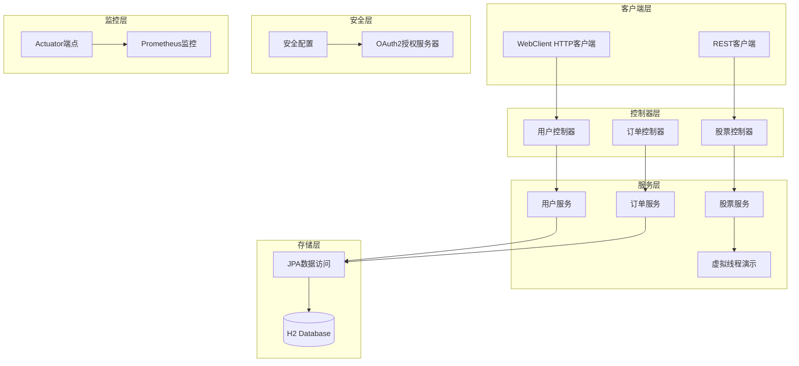

# test-VirtualThread - 项目规格说明书

## 1. 项目概述

- **项目名称**: test-VirtualThread
- **项目类型**: Spring Boot Maven 项目
- **Java 版本**: 25
- **Spring Boot 版本**: 3.4.4

## 2. 架构图



## 3. 技术栈

| 技术 | 版本 | 说明 |
|------|------|------|
| Spring Boot | 3.4.4 | 核心框架 |
| Spring Web | - | 传统 Web 栈 |
| Spring WebFlux | - | 响应式 Web |
| Spring Data JPA | - | 数据持久化 |
| H2 Database | - | 内存数据库 |
| Spring Security | - | 安全框架 |
| OAuth2 Authorization Server | - | 授权服务器 |
| Micrometer + Prometheus | - | 监控指标 |
| Lombok | 1.18.40 | 简化代码 |

## 4. 项目结构

```
test-VirtualThread/
├── src/main/java/wo1261931780/
│   ├── config/              # 配置类
│   │   ├── AuthServerConfig.java
│   │   ├── WebClientConfig.java
│   │   └── VirtualThreadConfig.java
│   ├── controller/          # 控制器
│   ├── client/              # HTTP 客户端
│   │   ├── UserClient.java
│   │   └── StockServiceClient.java
│   ├── service/            # 服务层
│   ├── entity/             # 实体类
│   │   ├── User.java
│   │   ├── Order.java
│   │   └── Product.java
│   └── demo/               # 演示代码
│       └── VirtualThreadDemo.java
├── src/main/resources/
│   ├── application.yml
│   └── data.sql
└── pom.xml
```

## 5. 构建命令

```bash
mvn clean compile     # 编译
mvn clean package     # 打包
mvn clean install     # 安装
```

## 6. 最后更新时间

2026-04-23
